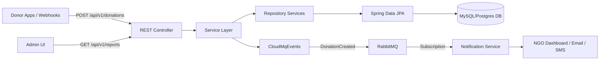
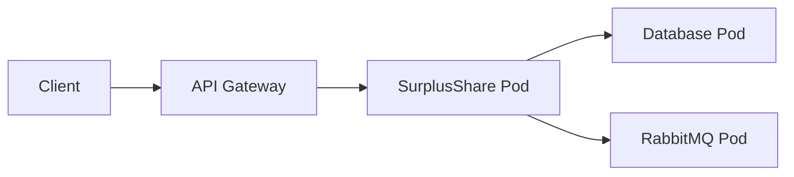
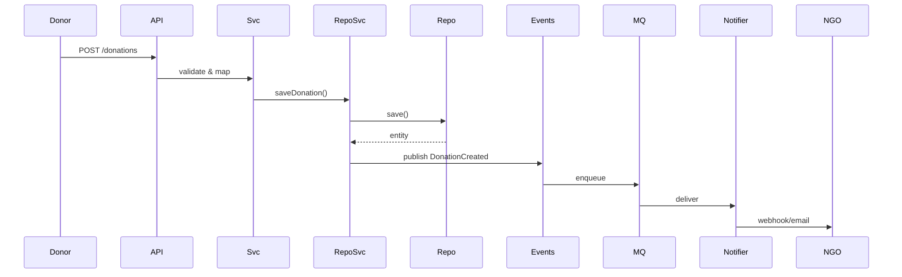

# SurplusShare: A Food Redistribution Platform for Social Impact

## Overview

SurplusShare is a full-stack backend service designed to collect, manage, and redistribute surplus food from restaurants, canteens, and households directly to NGOs and underprivileged communities. It’s built with a modular, layered architecture, event-driven messaging, and enterprise-grade patterns to ensure reliability, scalability, and maintainability.

## Table of Contents

- [Key Features](#key-features)  
- [Architecture](#architecture)  
- [Module Breakdown](#module-breakdown)  
- [Directory Structure](#directory-structure)  
- [Getting Started](#getting-started)  
- [Configuration](#configuration)  
- [Environment Variables](#environment-variables)  
- [Running the Service](#running-the-service)  
- [API Usage](#api-usage)  
- [Data Model](#data-model)  
- [Design Patterns & Highlights](#design-patterns--highlights)  
- [Mermaid Diagrams](#mermaid-diagrams)  
- [Testing & CI/CD](#testing--cicd)  
- [Monitoring & Health](#monitoring--health)  
- [Contributing](#contributing)  
- [License](#license)  
- [Contact](#contact)  

---

## Key Features

- Real-time donation lifecycle: creation, pickup, delivery  
- Role-based access control: Donors, NGOs, Admins  
- Event-driven notifications via RabbitMQ  
- Global exception handling with AOP advice  
- DTO ↔ Entity mapping using MapStruct  
- Spring Boot actuator for health and metrics  
- Extensible proxy layer for SMS/email/webhooks  
- Configurable multi-datasource support  

---

## Architecture



# 🥫 SurplusShare – Food Waste Management System

A scalable Spring Boot backend service for managing food donations, pickup coordination, and real-time event handling using RabbitMQ.

---

## 📦 Module Breakdown

| Module        | Purpose                                                             |
|---------------|---------------------------------------------------------------------|
| `aop/`        | Global exception handlers, logging aspects                          |
| `configs/`    | YAML/Java configs (DataSource, RabbitMQ, Swagger)                   |
| `controllers/`| REST endpoints with request/response validation                     |
| `dtos/`       | Data Transfer Objects for API payloads                              |
| `domains/`    | JPA entities (`Donation`, `User`, `Location`)                       |
| `enums/`      | Status and type definitions                                         |
| `exceptions/` | Business logic and validation error classes                         |
| `mappers/`    | MapStruct interfaces for DTO ↔ Entity mapping                       |
| `events/`     | RabbitMQ publishers/subscribers                                     |
| `proxies/`    | HTTP clients for external services                                  |
| `reposervices/`| Transactional data operations with orchestration                  |
| `repositories/`| Spring Data JPA interfaces                                         |
| `services/`   | Business orchestration interfaces                                   |
| `servicesimpl/`| Concrete implementations of services                              |

---

## 📁 Directory Structure
```text
SurplusShare/
├── src/
│   └── main/
│       ├── java/com/surplusshare/
│       │   ├── aop/
│       │   ├── configs/
│       │   ├── controllers/
│       │   ├── dtos/
│       │   ├── domains/
│       │   ├── enums/
│       │   ├── exceptions/
│       │   ├── mappers/
│       │   ├── events/
│       │   ├── proxies/
│       │   ├── reposervices/
│       │   ├── repositories/
│       │   ├── services/
│       │   └── servicesimpl/
│       └── resources/
│           ├── application.yml
│           └── db/
└── pom.xml
```


Getting Started
prerequisites:
  - "Java 17 or later"
  - "Maven 3.8+"
  - "MySQL or PostgreSQL"
  - "RabbitMQ 3.x"

configuration:
  spring:
    datasource:
      url: "jdbc:mysql://localhost:3306/surplusshare"
      username: "root"
      password: "password"
    jpa:
      hibernate:
        ddl-auto: "update"
  rabbitmq:
    host: "localhost"
    port: 5672
    username: "guest"
    password: "guest"
  management:
    endpoints:
      web:
        exposure:
          include:
            - "health"
            - "info"
            - "metrics"

environmentVariables:
  DB_URL: "JDBC URL for primary database"
  DB_USERNAME: "Database user"
  DB_PASSWORD: "Database password"
  RABBIT_HOST: "RabbitMQ host"
  RABBIT_PORT: "RabbitMQ port"
  RABBIT_USER: "RabbitMQ user"
  RABBIT_PASS: "RabbitMQ password"

runningService: |
  git clone https://github.com/Shubh00796/-Food-Waste-Management-System.git
  cd -Food-Waste-Management-System
  mvn clean package -DskipTests
  java -jar target/FoodWasteManagementSystem-0.0.1-SNAPSHOT.jar
  # Swagger UI: http://localhost:8080/swagger-ui.html

apiUsage:
  createDonation:
    method: POST
    path: /api/v1/donations
    headers:
      Content-Type: "application/json"
    body: |
      {
        "donorId": "user-123",
        "items": [
          { "name": "Rice", "quantity": 10, "unit": "kg"  ],
        "pickupTime": "2025-07-20T14:00:00"
      }
  listDonations:
    method: GET
    path: /api/v1/donations
    query: "status=PENDING"
  confirmPickup:
    method: PATCH
    path: /api/v1/donations/{donationId}/confirm

dataModel:
  Donation:
    keyFields:
      - id
      - donorId
      - status
      - pickupTime
  User:
    keyFields:
      - id
      - name
      - role
      - contactInfo
  Location:
    keyFields:
      - id
      - address
      - latitude
      - longitude

designPatternsAndHighlights:
  - "Strategy for dynamic notification channels"
  - "Factory for event payload creation"
  - "Observer via RabbitMQ subscriptions"
  - "Specification for flexible query filtering"
  - "Command for asynchronous task execution"
  - "AOP for centralized error handling and logging"

Mermaid Diagrams

Deployment Topology

### 🛠️ Donation Flow






testing_ci_cd: |
  ## 🧪 Testing & CI/CD

  We ensure rock-solid quality and continuous delivery:

  - **Unit Tests**: JUnit 5 & Mockito with 95%+ coverage targets  
  - **Integration Tests**: Testcontainers spinning up real database & broker instances  
  - **Code Coverage**: Enforced at **90%+** via JaCoCo report  
  - **CI Pipeline**: GitHub Actions workflow (`.github/workflows/ci.yml`)
    ```yaml
    name: CI/CD Pipeline
    on: [push, pull_request]
    jobs:
      build-test:
        runs-on: ubuntu-latest
        steps:
          - uses: actions/checkout@v2
          - name: Set up JDK 17
            uses: actions/setup-java@v3
            with:
              java-version: '17'
          - name: Build & Test
            run: mvn clean verify
          - name: Publish Coverage
            uses: codecov/codecov-action@v2
    ```

monitoring_and_health: |
  ## 📈 Monitoring & Health

  Keep a pulse on the system with:

  - **Spring Boot Actuator**
    - `/actuator/health`
    - `/actuator/metrics`
  - **Prometheus & Grafana**
    - Scrape Actuator endpoints
    - Pre-built dashboards in `configs/monitoring`
  - **Centralized Logging**
    - Logback configuration
    - ELK stack (Elasticsearch, Logstash, Kibana)

  ```yaml

  # Example Prometheus scrape config
  scrape_configs:
    - job_name: 'surplusshare'
      metrics_path: '/actuator/prometheus'
      static_configs:
        - targets: ['host.docker.internal:8080']
